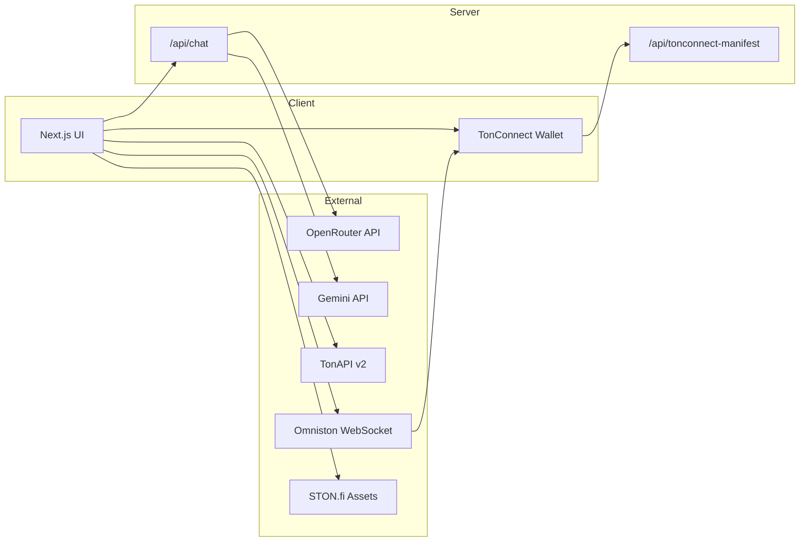

# TON AI Swap Advisor

An AI-powered DeFi co-pilot for the TON blockchain. Connect your wallet, view your portfolio, chat with an AI advisor in plain English, and execute swaps in one click via [STON.fi Omniston](https://docs.ston.fi).

Built for the [STON.fi Vibe Coding Hackathon](https://ston.fi/hackathon).

**Live demo:** [ton-ai-swap-advisor.vercel.app](https://ton-ai-swap-advisor.vercel.app)

**Repository:** [github.com/panditdhamdhere/TONai_Swap_advisor](https://github.com/panditdhamdhere/TONai_Swap_advisor)

---

## Features

- **Wallet connect** — TonConnect integration (Tonkeeper, etc.)
- **Portfolio view** — TON balance + top 5 jettons by USD value (TonAPI v2)
- **AI swap advisor** — Natural-language recommendations powered by Gemini (free tier)
- **One-click swaps** — Live Omniston RFQ quotes → wallet signing → on-chain settlement
- **Swap history** — Last 5 swap events from TonAPI
- **Responsive UI** — 40/60 split dashboard on desktop, stacked on mobile
- **Landing hero** — Feature overview + Connect Wallet CTA when disconnected

---

## Tech Stack

| Layer | Technology |
|-------|------------|
| Framework | Next.js 16, TypeScript, Tailwind CSS v4 |
| Wallet | `@tonconnect/ui-react@2.4.4` |
| Swaps | `@ston-fi/omniston-sdk@0.7.2`, `@ston-fi/omniston-sdk-react@0.4.2` |
| On-chain | `@ton/ton` (tx hash resolution) |
| Balances | [TonAPI v2](https://tonapi.io) |
| Token list | [STON.fi Assets API](https://api.ston.fi/v1/assets) |
| AI | OpenRouter (free models), Google Gemini, or Anthropic Claude |
| Deploy | Vercel |

---

## Architecture



### User flow

1. Connect TON wallet via TonConnect
2. App fetches balances from TonAPI and sends an AI opening message
3. User asks e.g. *"Swap 50% of my TON to USDT"*
4. AI responds with advice; when confirmed, returns a parseable swap JSON block
5. App resolves token addresses (STON.fi), fetches live Omniston quote
6. User clicks **Execute Swap** → TonConnect signs → trade tracked on-chain
7. Success shows green confirmation with [Tonscan](https://tonscan.org) link

---

## Getting Started

### Prerequisites

- Node.js 18+
- npm
- A TON wallet (Tonkeeper recommended)
- A free AI API key from [OpenRouter](https://openrouter.ai/keys) (recommended), [Gemini](https://aistudio.google.com/apikey), or Anthropic

### 1. Clone & install

```bash
git clone https://github.com/panditdhamdhere/TONai_Swap_advisor.git
cd TONai_Swap_advisor
npm install
```

### 2. Environment variables

Copy the example file and fill in your keys:

```bash
cp .env.example .env.local
```

| Variable | Required | Description |
|----------|----------|-------------|
| `OPENROUTER_API_KEY` | Yes (recommended) | Free key from [OpenRouter](https://openrouter.ai/keys) |
| `OPENROUTER_MODEL` | No | e.g. `google/gemma-2-9b-it:free` (auto-fallback if omitted) |
| `GEMINI_API_KEY` | No | Free alternative from [Google AI Studio](https://aistudio.google.com/apikey) |
| `NEXT_PUBLIC_APP_URL` | Yes | `http://localhost:3000` locally, your Vercel URL in production |
| `ANTHROPIC_API_KEY` | No | Optional paid alternative |

Example `.env.local`:

```bash
OPENROUTER_API_KEY=your_openrouter_key_here
NEXT_PUBLIC_APP_URL=http://localhost:3000
```

### 3. Run locally

```bash
npm run dev
```

Open [http://localhost:3000](http://localhost:3000).

> **Wallet tip:** Use the **Tonkeeper browser extension** for local dev. Mobile Tonkeeper cannot reach `localhost` — use the [live Vercel URL](https://ton-ai-swap-advisor.vercel.app) instead.

### 4. Build for production

```bash
npm run build
npm start
```

---

## Deploy to Vercel

1. Import the GitHub repo in [Vercel](https://vercel.com/new)
2. Add **Environment Variables** (Settings → Environment Variables):

   | Name | Value |
   |------|-------|
   | `OPENROUTER_API_KEY` | Your OpenRouter API key |
   | `NEXT_PUBLIC_APP_URL` | `https://ton-ai-swap-advisor.vercel.app` |

3. Deploy (or push to `main` for auto-deploy)

4. Verify manifest is reachable:

   ```
   https://your-app.vercel.app/tonconnect-manifest.json
   ```

   Should return JSON with `"url"` matching your domain.

---

## Usage

### Example prompts

- *"Should I swap my TON to USDT?"*
- *"Swap 50% of my TON to USDC"*
- *"What's the best move right now?"*

When the AI confirms a swap, it returns a JSON block the app parses:

```json
{ "action": "swap", "fromToken": "TON", "toToken": "USDT", "amount": "10" }
```

Percent amounts (e.g. `"50%"`) are resolved against your live wallet balance.

---

## Project Structure

```
ton-ai-swap-advisor/
├── app/
│   ├── api/
│   │   ├── chat/route.ts              # AI chat (OpenRouter / Gemini / Anthropic)
│   │   └── tonconnect-manifest/route.ts  # Dynamic TonConnect manifest
│   ├── layout.tsx
│   ├── page.tsx
│   ├── providers.tsx                  # App-wide providers
│   └── globals.css                    # Design tokens & animations
├── components/
│   ├── Dashboard.tsx                  # Main 40/60 layout
│   ├── ChatPanel.tsx                  # AI chat interface
│   ├── SwapConfirmCard.tsx            # Omniston quote + execute
│   ├── TokenCard.tsx                  # Balance cards
│   ├── TransactionHistory.tsx         # Recent swaps
│   ├── LandingHero.tsx                # Pre-connect landing
│   ├── TonConnectProvider.tsx         # Absolute manifest URL
│   ├── OmnistonErrorBoundary.tsx
│   └── OmnistonConnectionGuard.tsx
├── lib/
│   ├── tonapi.ts                      # TonAPI balances & swap history
│   ├── chat.ts                        # System prompt & swap JSON parser
│   ├── stonfi-assets.ts               # STON.fi token address lookup
│   ├── swap-utils.ts                  # Amount / base-unit helpers
│   ├── ton-tx.ts                      # BOC → tx hash for tracking
│   └── token-image.ts                 # TonAPI imgproxy URLs
└── public/
```

---

## API Routes

### `POST /api/chat`

Server-side AI chat. Accepts:

```json
{
  "messages": [{ "role": "user", "content": "..." }],
  "walletContext": [{ "symbol": "TON", "balance": 10, "usdValue": 15.9 }],
  "isOpeningMessage": false
}
```

Returns `{ "message": "..." }`. API keys never reach the client.

### `GET /tonconnect-manifest.json`

Dynamically served manifest for TonConnect (rewritten to `/api/tonconnect-manifest`). Returns correct `url` for localhost, Vercel production, or preview deployments.

---

## Hackathon Alignment

| Criterion | Status |
|-----------|--------|
| Functional working app | ✅ |
| TON integration (STON.fi Omniston) | ✅ `@ston-fi/omniston-sdk-react@0.4.2` |
| Clear use case | ✅ AI-guided swap advisor |
| GitHub repository | ✅ |
| Live production URL | ✅ [ton-ai-swap-advisor.vercel.app](https://ton-ai-swap-advisor.vercel.app) |
| Video presentation | 🔲 Record Loom demo |

**STON.fi track:** Omniston crosschain SDK integrated for live quotes and swap execution.

---

## Troubleshooting

### "Failed to load Manifest: 404"

- Use the **live Vercel URL**, not localhost, when connecting mobile Tonkeeper
- Ensure `NEXT_PUBLIC_APP_URL` is set in Vercel env vars
- Verify: `https://your-domain/tonconnect-manifest.json` returns JSON

### AI chat errors

- `.env.local` only works locally — add `OPENROUTER_API_KEY` in **Vercel Environment Variables**
- Remove invalid `ANTHROPIC_API_KEY` if you are not using Anthropic
- Redeploy after adding env vars
- Optional: set `OPENROUTER_MODEL=google/gemma-2-9b-it:free` for a specific free model

### "No swap route available"

- The token pair may have low liquidity on Omniston
- Try a common pair like TON → USDT

### Wallet shows 0 TON

- Connect a funded testnet/mainnet wallet
- The app reads real on-chain balances via TonAPI

---

## Scripts

| Command | Description |
|---------|-------------|
| `npm run dev` | Start dev server |
| `npm run build` | Production build |
| `npm run start` | Start production server |
| `npm run lint` | Run ESLint |

---

## License

MIT

---

## Acknowledgments

- [STON.fi](https://ston.fi) — Omniston SDK & hackathon
- [TonAPI](https://tonapi.io) — On-chain data
- [TonConnect](https://docs.ton.org/develop/dapps/ton-connect/overview) — Wallet connection
- [OpenRouter](https://openrouter.ai) — Free AI models
- [Google AI Studio](https://aistudio.google.com) — Gemini API
